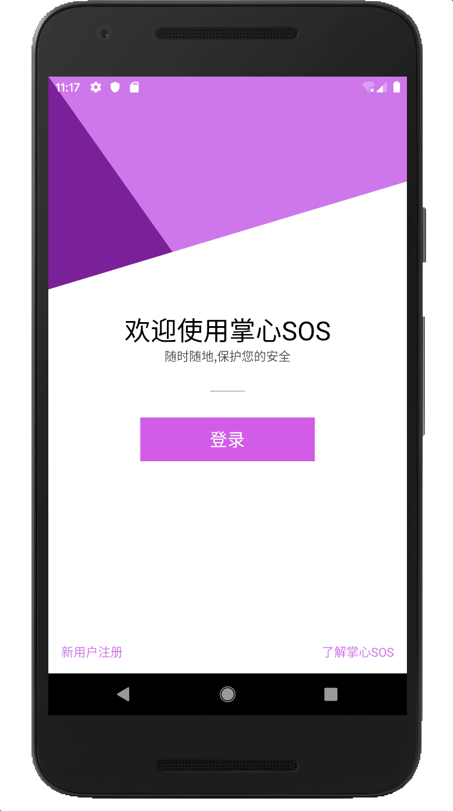
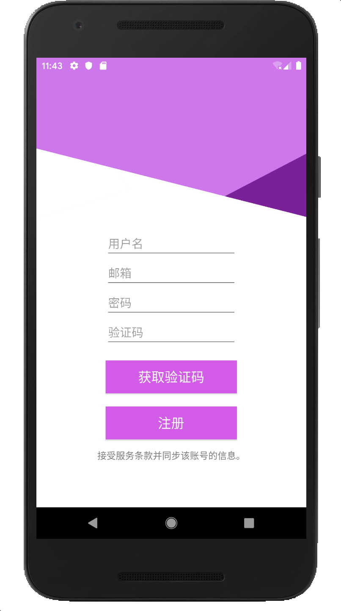
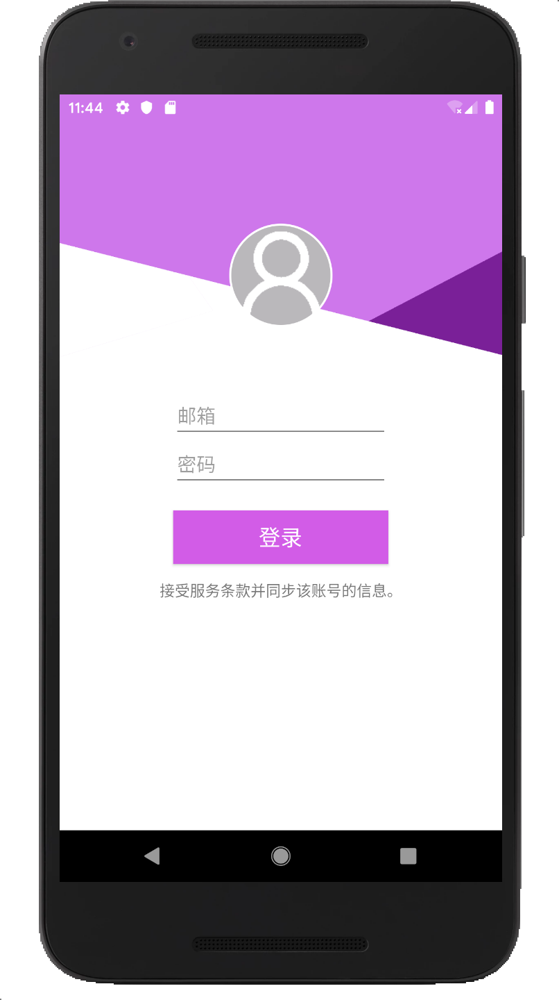
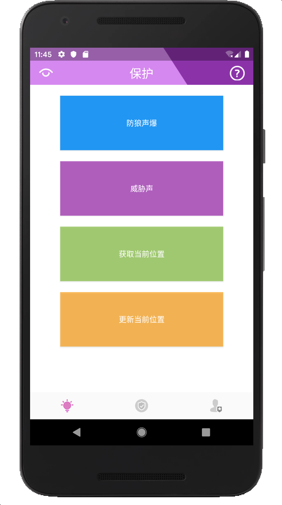
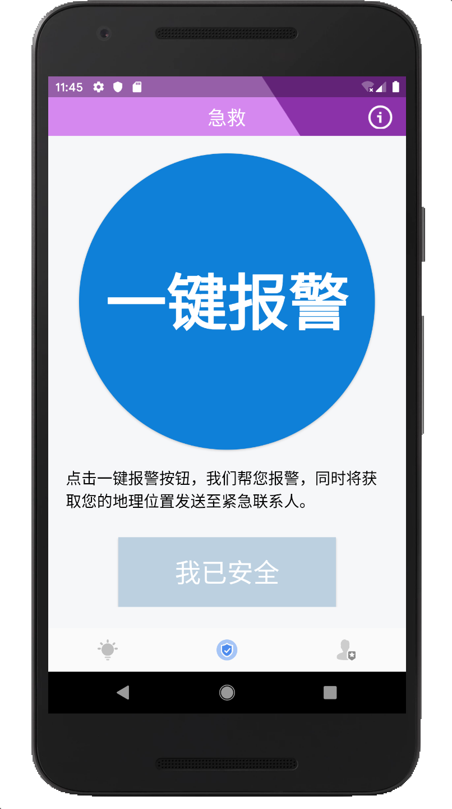
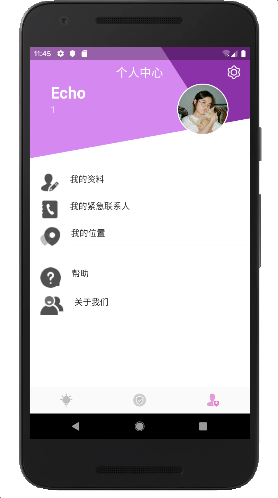
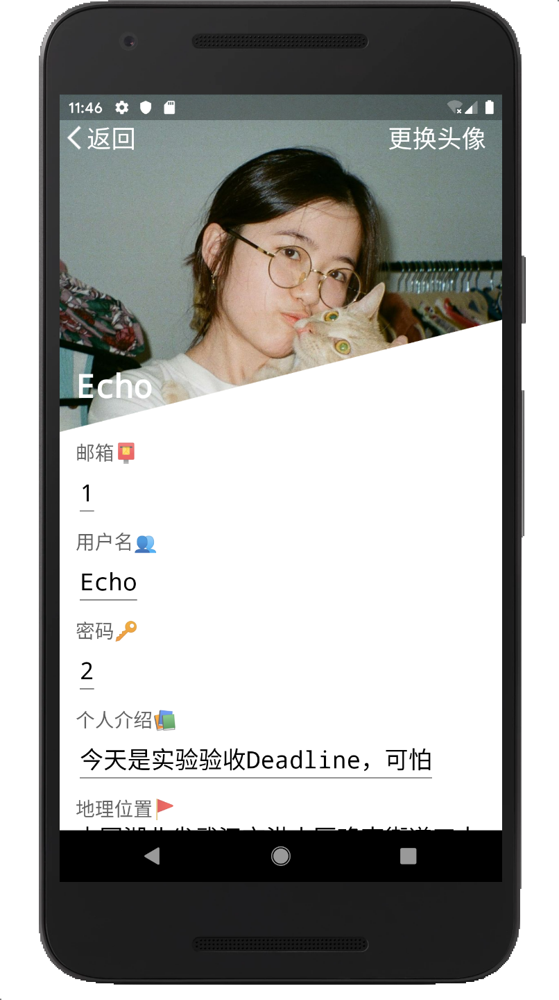
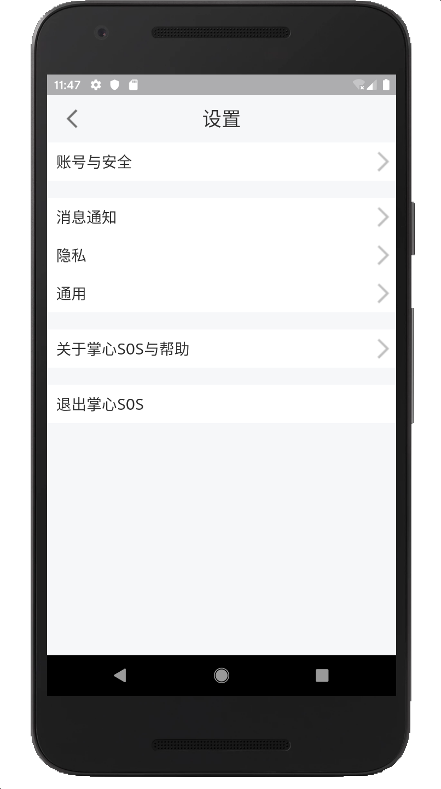
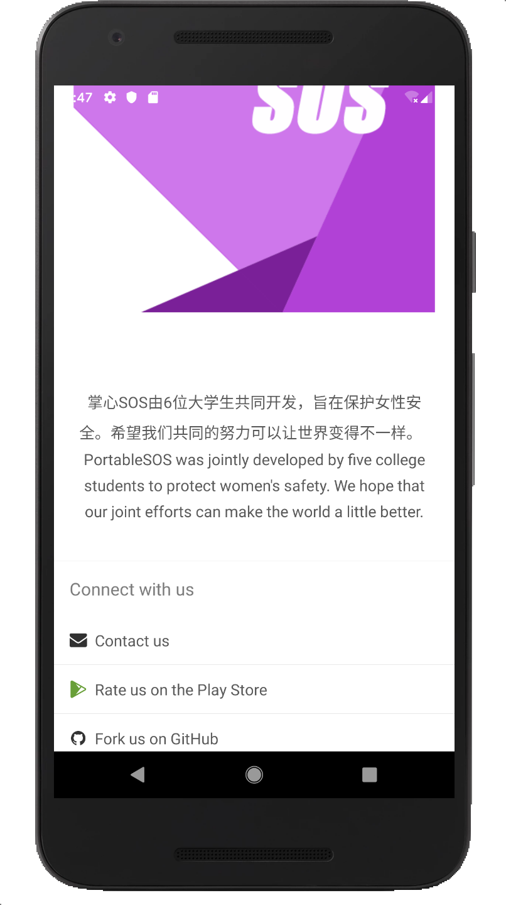

# PortableSOS(掌心SOS)(仿Tim界面)

## Introduce

一款用于保护女性人身安全的安卓app，项目基于Android开发，SSM后端开发，以及百度地图api。

## Screenshots

  
  
  

  
  
  

  
  
  

## Version

### V1.1.0 (2019.10.8)

- 实现基础功能（注册、登录、基本的安全守护功能）
- 音频的在线播放、地理位置的获取、自动拨号以及个人中心的资料显示

### V2.1.0 (2020.1.7)

- 添加权限获取提示
- 规范文件名及包名
- 修复联系人列表重复加载数据问题
- 修复个人资料中安全状态显示错误问题
- 修复未彻底退出app问题
- 个人中心姓名和邮箱未正确显示问题
- 规范后台交互代码（抽取更新用户信息方法至统一的类中）
- Handler处理Toast事件
- 首页ui美化

### V2.2.0 (2020.1.8)

- 美化首页界面的颜色
- 报警及安全后修改个人安全状态
- 点击报警按钮，发送短信及拨打报警电话

### 

